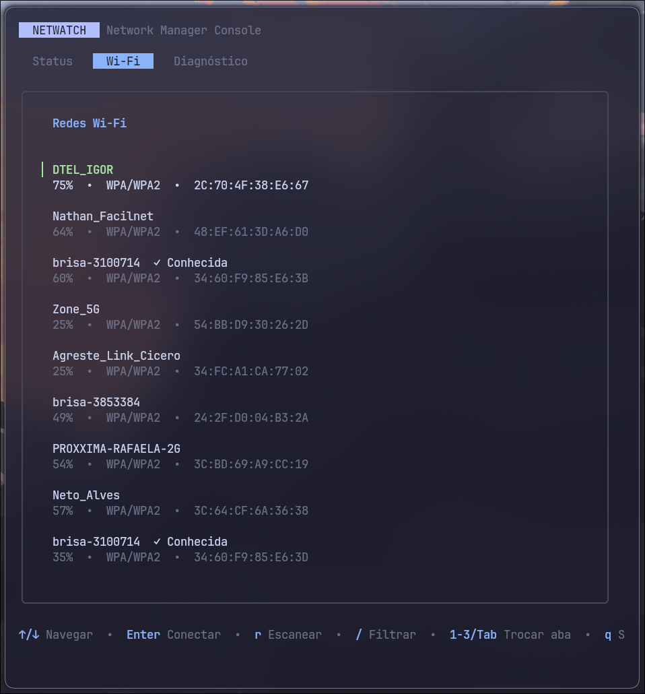

<p align="center">
  
  &nbsp;&nbsp;
  
  &nbsp;&nbsp;
  
</p>

<h1 align="center">NetWatch</h1>

<p align="center">
  Linux CLI and TUI for network diagnostics and Wi-Fi management through NetworkManager and D-Bus.
</p>

<p align="center">
  
  
  
</p>

---



## Description

NetWatch is a robust, **Linux-only** CLI and TUI developed in Go, designed to centralize network diagnostics and Wi-Fi management. Built to solve the lack of modern, responsive terminal user interfaces for networking, it provides a unified experience without the need to parse external processes (like `nmcli` or `iwconfig`). 

The application communicates directly with NetworkManager via the operating system's D-Bus, ensuring high performance, accurate synchronous responses, and low resource consumption. Additionally, it performs parallel checks for ICMP latency, DNS resolution, TCP ports, and default gateway integrity.

>**Tip for Custom Desktop Environments:** It is incredibly easy to integrate the TUI into status bars like **Waybar** by simply binding `netwatch menu` (or your terminal executing it, e.g., `alacritty -e netwatch menu`) to an `on-click` event

---

## Features

* Network connectivity diagnostics
* ICMP, DNS and TCP connectivity tests
* Wi-Fi network listing and management
* Secure Wi-Fi password input
* Interactive TUI built with Bubble Tea
* NetworkManager integration through D-Bus
* Automated installation script
* Automated tests and CI

## Stack

* **Go**
* **Cobra** — CLI
* **Bubble Tea** — TUI
* **NetworkManager D-Bus API**
* **godbus/v5**
* **x/term**
* **GitHub Actions**

## Installation

Requirements:

* Linux
* NetworkManager
* D-Bus
* Go 1.25+ (only required for building from source)

### Quick install

```bash
curl -sL https://raw.githubusercontent.com/LuisH07/netwatch/main/install.sh | bash

```

### From source

```bash
git clone https://github.com/LuisH07/netwatch.git
cd netwatch
chmod +x install.sh
./install.sh

```

## Usage

Check network connectivity:

```bash
netwatch check

```

Show current Wi-Fi connection:

```bash
netwatch wifi

```

List available networks:

```bash
netwatch wifi list

```

Connect to a network:

```bash
netwatch wifi connect "Network Name"

```

Disconnect from Wi-Fi:

```bash
netwatch wifi disconnect

```

Launch the interactive interface:

```bash
netwatch menu

```

## Shell Completion

To enable automatic command completion with the `Tab` key in your terminal, add the corresponding configuration to your shell:

### Bash

```bash
echo "source <(netwatch completion bash)" >> ~/.bashrc
source ~/.bashrc

```

### Zsh

```bash
echo "source <(netwatch completion zsh)" >> ~/.zshrc
source ~/.zshrc

```

## Testing

Run the test suite:

```bash
go test ./...

```

Run with race detection:

```bash
go test -race ./...

```

## Project Structure

```text
netwatch/
├── cmd/
├── internal/
├── assets/
├── install.sh
├── main.go
├── go.mod
├── go.sum
├── LICENSE
└── README.md

```

## License

This project is licensed under the MIT License.